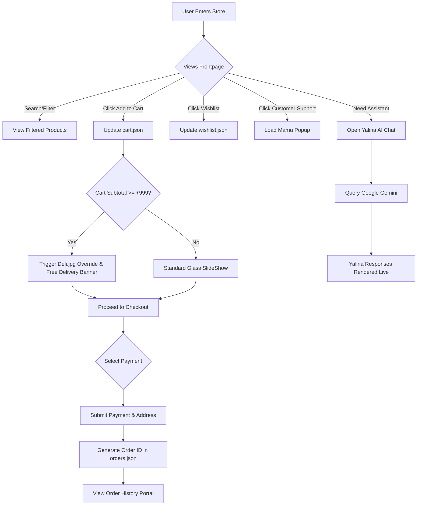
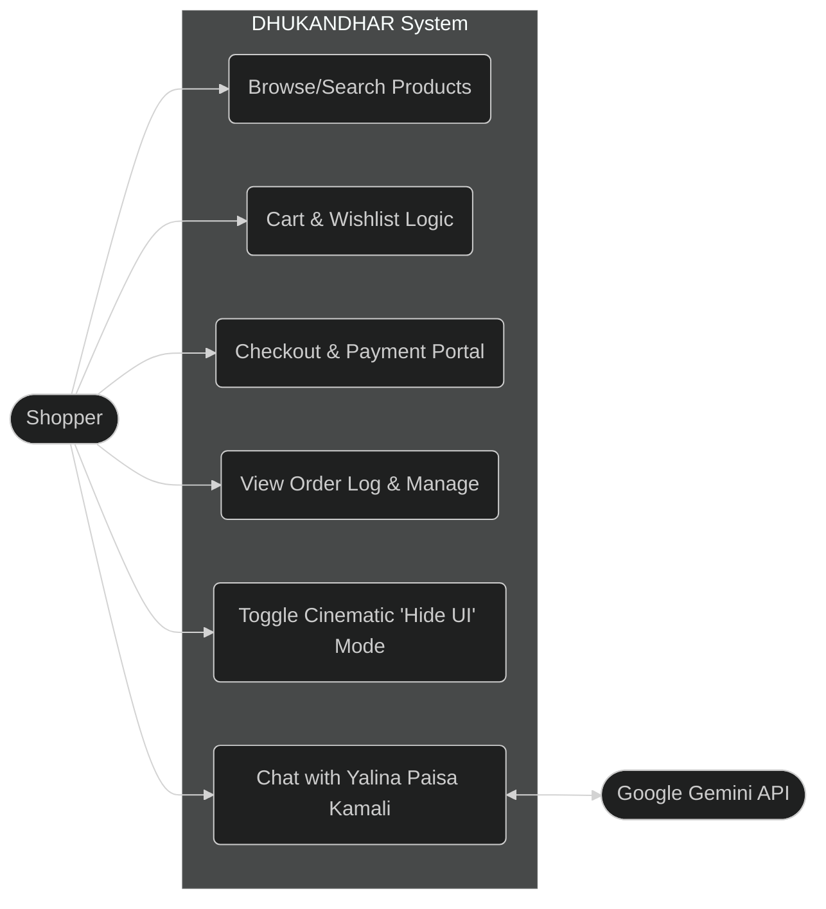

# DHUKANDHAR: The Revenge 🛒🔥

Welcome to **DHUKANDHAR: The Revenge** — a blood-red and gold infused e-commerce frontend simulation built on Flask and Bootstrap. This project completely reinvents the standard shopping cart mockup into a dynamic, extremely glassy, and hyper-premium user interface.

## 🌟 Key Features

1. **Extreme Glassmorphism Architecture**:
   - Zero solid white or black block backgrounds anywhere.
   - Entire application styled using deep `backdrop-filter: blur(25px)` logic and high-contrast ambient glows.
   - Front page products feature `mix-blend-mode: hard-light` logic to remove standard `.jpg/.png` background blocks organically within the CSS renderer!

2. **Kinematic Environmental Backgrounds**:
   - The user interface rotates through an animated loop of handpicked aesthetic images (`bg.jpg`, `001.jpg`, `002.jpg`, `003.jpg`) over a 24-second continuous cinematic loop cycle.
   - **Full UI Toggle**: Just click anywhere on an empty background space on any page, and the entire foreground UI gracefully fades away so you can view the aesthetic background unobstructed! Click again to instantly retrieve your session!

3. **Free Delivery System Takeover**:
   - Integrated dynamic shopping cart calculations in standard memory (`get_global_delivery` flag in Flask `app.py`).
   - System Override: If the subtotal hits **₹999**, a global override locks the interface. The background slideshow vanishes, a custom `deli.jpg` static wallpaper assumes command, and a cascading "🚀 FREE DELIVERY ACTIVATED! 🎉" marquee banner gracefully locks into view.

4. **Yalina Paisa Kamali - The AI Integrated Indian Wife Assistant**:
   - Directly wired into the **Google Gemini Native API** (`gemini-2.5-flash`).
   - Self-healing node fallback algorithm automatically swaps to `gemini-1.5-flash` whenever Gemini traffic demand metrics reach 503 capacity.
   - She speaks Hinglish strictly, utilizing extremely loving, respectful, and strictly-professional polite Indian wife mannerisms (like referring to the user exclusively as 'ji', 'sartaj', or 'mamu').
   - Custom floating semi-transparent web chat container with a functional UI pulse beacon.

## 📁 Project Folder Structure

```text
shoppingcart/
├── app.py                 # Main Flask application and server routes
├── products.json          # Database representing 100+ simulated products
├── cart.json              # Local memory for active shopping carts
├── orders.json            # Persistent user order history and status array
├── wishlist.json          # Simple memory for favorited products
├── static/                # Aesthetic resources (images, styles, assets)
│   ├── bg.jpg             # Base background cinematic loop 
│   ├── 001.jpg, 002.jpg   # Supplementary slideshow images
│   ├── deli.jpg           # Free delivery override visual
│   ├── E2oTT.jpg          # Avatar for Yalina Paisa Kamali (AI Assistant)
│   └── manager.jpg        # "Mamu" customer support easter egg overlay
└── templates/             # HTML Jinja2 render templates
    ├── layout.html        # Core layout mapping containing AI JS & Glass CSS
    ├── index.html         # Live storefront with dynamic cards
    ├── cart.html          # Shopping cart logic and subtotal aggregations
    ├── checkout.html      # Address input and payment simulation portal
    └── orders.html        # Order management console
```

## 🔄 User Flow Diagram



## 👥 Use Case Diagram



## ⚙️ Overall Functional Flow

The DHUKANDHAR shopping cart operates iteratively on stateless `JSON` databases using Python's `Flask` as a middleware.
1. **Frontend Interaction**: Users render Jinja templates composed dynamically by `layout.html`. The UI relies entirely on DOM-rendered CSS variables and `mix-blend-mode: hard-light` functions to generate its distinct glassy styling.
2. **Global State Detection**: `app.py` globally calculates cart prices before any render via `@app.context_processor`. If `subtotal >= 999`, it returns a boolean triggering a specific `<style>` logic tree overriding the cinematic loops inside `layout.html`.
3. **Cart Operations**: Basic HTTP `POST` events pass IDs to Flask routes, parsing `cart.json`, appending quantities, and redirecting visual logic instantly.
4. **AI Processing Generation**: Clicking the helper web-element injects a `fetch()` promise targeting Google Gemini 2.5 REST endpoints directly via frontend Javascript, processing user requests into live conversational nodes completely seamlessly overlaid on the application.

## 🛠️ Project Setup

1. **Clone the Source Code**: Navigate into the central directory.
2. **Deploy Dependencies**: Open Powershell / Command Prompt and run `pip install flask`.
3. **Validating Runtime Assets**: Check that `dhukandhar_logo.png`, `E2oTT.jpg`, and the background payload operate safely inside `/static`.
4. **Boot Local Server Loop**: Execute `python app.py`. This fires the local `Werkzeug` HTTP interface on port `5000`.
5. **Access Interface**: Connect via any modern local web browser synchronously through `http://127.0.0.1:5000`.

## 💻 Code System Example

The system intercepts global runtime flags efficiently via context processors, mitigating complex backend calls:

```python
@app.context_processor
def inject_globals():
    try:
        cart = load_cart()
        products = load_products()
        subtotal = sum(get_product(products, item['product_id'])['price'] * item['qty'] for item in cart)
        return {'year': datetime.now().year, 'global_free_delivery': subtotal >= 999}
    except Exception:
        return {'year': datetime.now().year, 'global_free_delivery': False}
```


